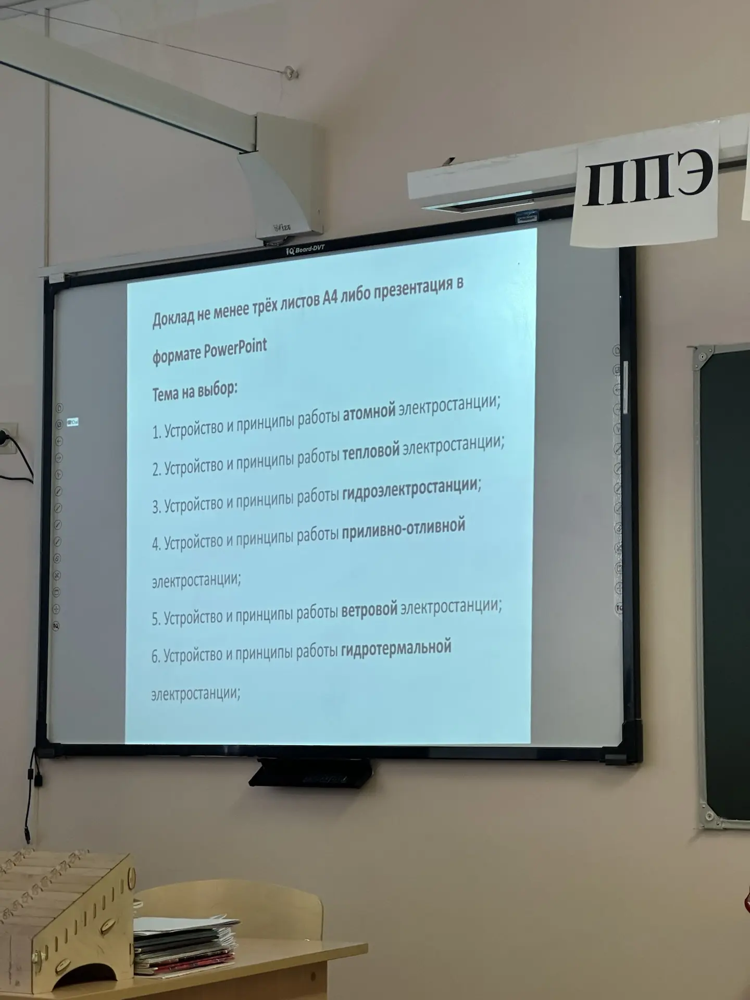

# ⚛️ Атомная электростанция: география и значение

> **Реферат по географии**  
> Тема: «География размещения атомных электростанций в мире и России»

---

## 📋 Содержание

- [Введение](#введение)
- [1. Принцип работы АЭС](#1-принцип-работы-аэс)
- [2. География размещения АЭС в мире](#2-география-размещения-аэс-в-мире)
- [3. Факторы размещения АЭС](#3-факторы-размещения-аэс)
- [4. АЭС в России](#4-аэс-в-россии)
- [5. Экологические риски и безопасность](#5-экологические-риски-и-безопасность)
- [Заключение](#заключение)
- [Источники](#источники)

---

## Введение

Атомная энергетика — один из ключевых источников электроэнергии в современном мире. По данным МАГАТЭ, на 2026 год в мире действует **438 ядерных реакторов** в **32 странах**, суммарная установленная мощность превышает **390 ГВт**. АЭС обеспечивают около **10%** мирового производства электроэнергии и играют важную роль в энергобезопасности многих государств.

География размещения атомных станций определяется комплексом природных, экономических и социальных факторов, знание которых необходимо для понимания глобальной энергетической карты мира.

---

## 1. Принцип работы АЭС

Атомная электростанция преобразует энергию деления тяжёлых атомных ядер (урана-235 или плутония-239) в электрическую энергию. Основные элементы:

1. **Ядерный реактор** — зона контролируемой цепной реакции.
2. **Теплообменник** — передача тепла от реактора к вторичному контуру.
3. **Турбина и генератор** — производство электроэнергии.

### Схема работы АЭС

```
    ⚛️ Ядерный реактор
            │
            ▼
    ┌───────────────┐
    │  Деление ядер │──→ 🌡️ Тепловая энергия
    │  U-235 / Pu   │
    └───────────────┘
            │
            ▼
    💧 Теплообменник (парогенератор)
            │
            ▼
    ┌───────────────┐
    │  Подогретый   │──→ 💨 Высокое давление пара
    │      пар      │
    └───────────────┘
            │
            ▼
    ⚙️ Турбина ──→ 🔌 Генератор ──→ ⚡ Электроэнергия
            │
            ▼
    ❄️ Конденсатор (охлаждение водой из реки/моря)
            │
            ▼
    💧 Возврат воды в контур (цикл повторяется)
```

> 💡 **Интересный факт:** Наиболее распространены реакторы с водой под давлением (PWR/BWR) и реакторы на быстрых нейтронах (БН).

---

## 2. География размещения АЭС в мире

### 2.1. Крупнейшие страны-операторы

| Страна | Кол-во реакторов | Доля в энергобалансе | Крупнейшая АЭС |
|--------|------------------|----------------------|----------------|
| 🇺🇸 США | 93 | ~19% | Пало-Верде |
| 🇫🇷 Франция | 56 | ~70% | Гравлин |
| 🇨🇳 Китай | 55 | ~5% | Тяньван |
| 🇷🇺 Россия | 37 | ~20% | Курская |
| 🇯🇵 Япония | 33 | ~6% | Касивадзаки-Карива |
| 🇰🇷 Южная Корея | 25 | ~30% | Хануль |

### 2.2. Региональные особенности

- **Европа:** высокая доля АЭС в энергобалансе (Франция, Словакия, Украина).
- **Азия:** наиболее быстрый рост (Китай, Индия, ОАЭ).
- **Северная Америка:** стабильная эксплуатация, старение парка реакторов.
- **Африка:** только ЮАР имеет действующую АЭС (Коberg).



---

## 3. Факторы размещения АЭС

Размещение атомной станции — сложный многофакторный процесс. Ключевые условия:

### 3.1. Природные факторы

1. **Водные ресурсы** — огромный расход воды для охлаждения реакторов (конденсационные станции требуют проточного водоёма).
2. **Сейсмическая стабильность** — АЭС строят в зонах с ускорением землетрясений не выше 0,3–0,5g (исключение — Япония, где используются усиленные конструкции).
3. **Рельеф местности** — ровная поверхность, отсутствие оползневых зон.

### 3.2. Экономические и социальные факторы

- Близость к промышленным центрам и городам-миллионникам.
- Наличие инфраструктуры (ЛЭП, железные дороги).
- Санитарные нормы: радиус обязательного отчуждения — обычно 3–5 км.

> ⚠️ **Важно:** Большинство АЭС в мире расположены вблизи крупных рек или морского побережья именно из-за потребности в охлаждении.

---

## 4. АЭС в России

Россия занимает **4-е место** в мире по количеству действующих реакторов. География российских АЭС отражает стратегию размещения в европейской части страны и на Урале — в районах с высоким энергопотреблением.

### Действующие АЭС

| АЭС | Регион | Мощность, МВт | Особенности |
|-----|--------|---------------|-------------|
| Балтийская АЭС | Калининградская обл. | 1100 | Единственная в регионе |
| Белоярская АЭС | Свердловская обл. | 1480 | Единственная БН-реакторы |
| Билибинская АЭС | Чукотка | 48 | Самая северная в России |
| Калининская АЭС | Тверская обл. | 4000 | 4 блока ВВЭР-1000 |
| Кольская АЭС | Мурманская обл. | 1760 | Северная локация |
| Курская АЭС | Курская обл. | 4000 | 4 блока РБМК-1000 |
| Ленинградская АЭС | Ленинградская обл. | 4200 | 4 блока ВВЭР-1200 |
| Нововоронежская АЭС | Воронежская обл. | 2773 | Первенец ВВЭР |
| Ростовская АЭС | Ростовская обл. | 4033 | 4 блока ВВЭР-1000 |
| Смоленская АЭС | Смоленская обл. | 3000 | 3 блока РБМК-1000 |

### Перспективы

В стадии строительства находятся:
- **Курская АЭС-2** — 2 блока ВВЭР-ТОИ
- **Ленинградская АЭС-2** — 2 блока ВВЭР-1200
- **Белорусская АЭС** (строится Росатомом за рубежом)

---

## 5. Экологические риски и безопасность

### 5.1. Преимущества

- **Низкие выбросы CO₂** — АЭС не выделяют парниковые газы в процессе работы.
- **Компактность** — небольшая площадь под станцию при огромной мощности.
- **Стабильность** — не зависят от погодных условий, в отличие от ВИЭ.

### 5.2. Риски

- **Радиоактивные отходы** — проблема долгосрочного хранения (глубокое геологическое захоронение).
- **Аварийный риск** — Чернобыль (1986) и Фукусима (2011) показали катастрофические последствия.
- **Тепловое загрязнение** — сброс нагретой воды в водоёмы влияет на экосистемы.

> 🔬 **Факт:** После аварии на Фукусиме-1 Германия объявила о поэтапном отказе от атомной энергетики (процесс завершится к 2025–2030 гг.), тогда как Франция сохраняет курс на атомную энергетику как базовую.

---

## Заключение

Атомная энергетика остаётся важнейшим элементом глобальной энергетики. География размещения АЭС диктуется необходимостью близости к водоёмам, сейсмической безопасностью и инфраструктурной освоенностью территорий. Россия, обладая мощным ядерным комплексом и передовыми технологиями реакторостроения (ВВЭР, БН), продолжает развивать атомную энергетику как ключевой фактор энергобезопасности и экспорта технологий.

---

## Источники

1. [PRIS — IAEA Power Reactor Information System](https://pris.iaea.org)
2. Всемирная ядерная ассоциация (WNA), статистика 2026 г.
3. Росатом, годовой отчёт 2025
4. Учебник географии, 10–11 класс (профильный уровень)
5. МАГАТЭ, доклад «Nuclear Power Reactors in the World» (2024)

---

*Работа выполнена в 2026 г.*
